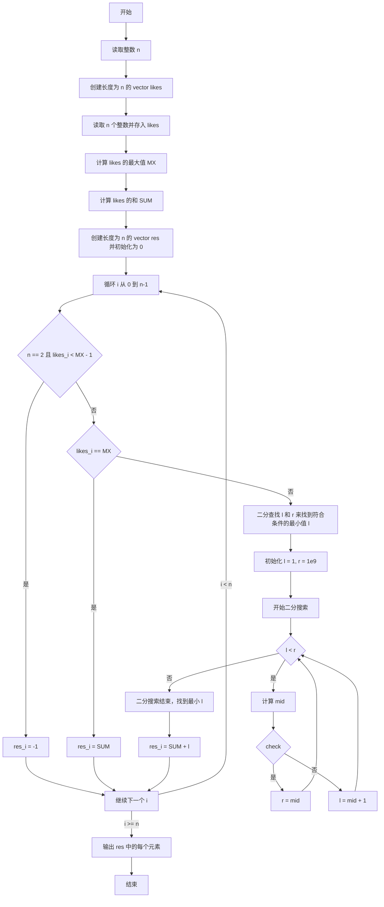

cin.get() 读入字符 

vector也可以以数组形式赋值

（algorithm）找最大元素的迭代器：max_element, 最大元素值 *max_element
(numeric)累加：accumulate

整型最大数：INT_MIN，INT_MAX (climits)
	最小的int：-2147483648
	最大的int：2147483647
大概是 2.1e9

### 小红书03

利用GPT绘制流程图来理解算法！

下次做题前，先画流程图！！！分离

> 2024年5月17日10:44:46：算法没理解，还是写不出来